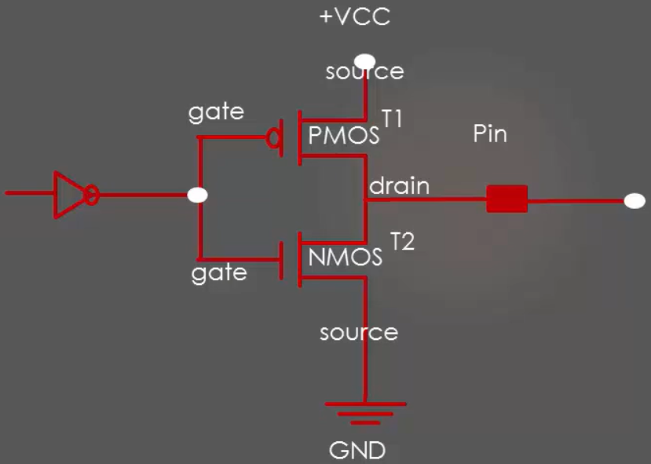

# **Mastering Microcontroller and Embedded Driver Development**

**About the Work**__

---

This work is about learning the concepts of various hardware components working principles, architecture and programming of various Microcontrollers for utilizing on my needs.
 

    so the concepts and architecture I will be learning are
        - Embedded Code Debugging
        - Understanding MCU Memory Map
        - MCU Bus Interface
        - Understanding MCU Clocks and Details
        - Understanding MCU Clock tree
        - Understanding MCU Vector table
        - Understanding MCU interrupt Design, NVIC, Interrupt handling
        - Importance of "Volatile" Keyword
        - GPIO concepts
        - GPIO Programming structure and Registers
        - GPIO Registers : SPEED, PULLUP/DOWN, IDR and ODR
        - GPIO Alternate functionality register and usage
        - GPIO peripheral clock control
        - GPIO driver development and MCU specific header file with bus domain and peripheral Details
        - Structuring peripheral registers
        - Writing Clock enable and disable macros
        - GPIO driver API requirements and handle structure
        - GPIO driver API Implementation : Clock control, GPIO init and de-init, GPIO data read and write
        - GPIO pin Interrupt configuration

## **KEY WORDS USED IN EMBEDDED SYSTEM**

    - opcodes
    - debugging
    - breakpoints

## **Phase - 1**

    Understanding Basic Working of Microcontrollers

### **Things about to Learn**

        - Embedded Code Debugging
        - Understanding MCU Memory Map
        - MCU Bus Interface
        - Understanding MCU Clocks and Details
        - Understanding MCU Clock tree
        - Understanding MCU Vector table
        - Understanding MCU interrupt Design, NVIC, Interrupt handling
        - Importance of "Volatile" Keyword

**Information and Knowledge about the topics**

---

Embedded Code Debugging
---

    Embedded Code Debugging Options:
        - Serial Wire Viewer and data tracing(printf style debugging)
        - Single stepping, Stepping over and Stepping out 
        - Breakpoint / Hardware Breakpoint (Inserting, Deleting and Skipping Breakpoints) 
        - Disassembly (Converting Higher Level language to Assembly level language)
        - Call stack
        - Expression and Variable windows
        - Memory browser (Used to examine various contents of memories of the microcontroller, flash, SRAM, etc)
        - Data watch-points

    1. SWV and ITM based prinf style debugging
        - 
    2. Single stepping, Stepping over and Stepping out 
        - single stepping / stepping into ( stepping into the function or subroutine)
        - stepping over ()
        - stepping return / stepping over (stepping out of the function or subroutine)
    3. Disassembly and Register windows 
    
    4. Breakpoints / Hardware Breakpoint
        - Breakpoints are the ways to tell the processor to halt or stop exeecution at certain instruction address

    5. Expression and Variable windows

    6. Memory browser windows

    7. Call stack and fault analyzers

    8. Data watch-points

    9. SFR windows (Special function register window)

**Summary or General Understanding**

---

**MCU Bus Interfaces**
---

**Memory Map of MCU (STM32F411EVT6)**

***Key Words MCU Bus Interfaces***
___

    - System Bus
    - Processor
    - ARM Cortex M4

***Memory map of the MCU (Refere Memory Map of the specific Microcontrollers)***

---

- ARM Cortex-M4
- Width of the system bus is 32 bits.
- The processor can produce 2^32 of different addresses. 4G.
- 0x0000_0000 to 0xffff_ffff
- What's the base address of SRAM2 ?
  - SRMA1 starts from 0x20000_0000
  - Size of SRAM1 = X bytes
  - base address of SRAM2 = 0x2000 0000 + X
  - BASE_ADDRESS_OF_SRAM2 = BASE_ADDRESS_OF_SRAM1 + SIZE_OF_SRAM1

---
 

**MCU BUS INTERFACE**
___

    - I-Bus (Instruction Bus)
    - D-Bus (Data Bus)
    - S-Bus (System Busf )

---
 

**MCU CLOCKING SYSTEM**

 

---

*The Different Clock Sources for MCU are :*

    - HSE Oscillator Clock (Crystal Oscillator)  External to MCU
    - HSI Oscillator Clock (RC Oscillator) Internal to MCU
    - Main PLL Clock (Phase Locked Loop) Internal to MCU

_MCU Clock Source and HSE
:_

     HSE can be provided to the MCU via a crystal or external source ( from another ckt or from anther MCU)

*MCU Clock Source and HSI :*

    The HSI signal is generated from internal 16MHz or MUC specific RC Oscillator and can be used directly as a system clock, or as PLL input.

    It also has a faster startup time than the HSE crystal oscillator however, even with calibration the frequency is less accurate than an external crystal oscillator or ceramic resonator.

    On system reset the MCU select HSI as default clock source.  

MCU Clock Source and PLL :_

---

## Phase-**2** _**(GPIO Driver Development)**_

### **Key Words On GPIO Driver Development**

    - GPIO prots
    - IO Pins
    - 

***GPIO Must Know Concepts***

  - GPIO's has no ports and each ports has specific set of pins to get configured.

>Behind the scene the GPIO's has buffer activation
 

- ***Ther are two buffers***
  - ***Input Buffer(PMOS Transistor)***
  - ***Output Buffer(NMOS Transistor)***
- so when the signal is *HIGH* from the system, PMOS get Activated and NMOS get deactivated.
  - So You will get Higher potential voltage from the drain
- And when the signal is *LOW* the visversa happens.
  - You will get Lower potential voltage from the drain.
  
    